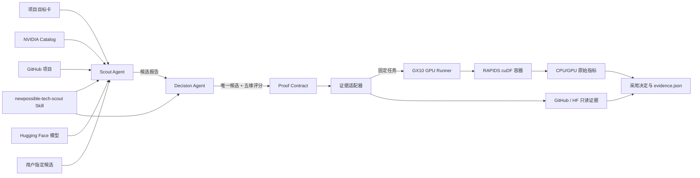

# NewPossible

**你不用追赶技术更新。真正改变你项目的那一刻，我们才来打扰你。**

NewPossible 的参赛交付是 `newpossible-tech-scout` Agent Skill。基于 Vercel AI SDK 的两个 TypeScript Agent 在运行时加载同一个 Skill：Scout Agent 从 NVIDIA Catalog、GitHub、Hugging Face 和用户指定项中发现候选，Decision Agent 按统一规则只选择一个。StepFun `step-3.7-flash` 负责两种角色的工具调用与结构化判断，受控证据适配器再交付 `adopt`、`watch` 或 `reject` 决定。Web 页面展示完整决策轨迹，比赛提供的 GX10 执行需要真实 GPU 的性能证明。

## 项目说明

技术团队面对的困难通常不是“找不到资讯”，而是没有精力持续判断一条更新是否真正改变当前项目。普通资讯流会把发布新闻、模型榜单、开源仓库和营销数字一起推给用户，最终仍需要开发者自行完成相关性判断、环境核对、实验设计和采用决策。NewPossible 将这条链路封装为可安装的 Agent Skill：先读取项目目标、技术栈、约束和期望能力，再从可追溯的官方信号中筛选候选；只有候选与项目直接相关、能够设计低成本验证且可能产生明确能力增量时，才占用用户注意力。

候选来自四个入口：Agent 实时查询 NVIDIA 官方 Skill Catalog、GitHub 公开项目和 Hugging Face 模型，也允许用户在目标卡中每行填写一个自己关注的技术，最多五项。模型把多源在线候选、用户候选和仓库内已有证据的候选放在同一评分规则下比较，最终只留下一个。在线新候选和用户候选如果尚无受控实验适配器，只会返回 `watch / unverified`；不会下载并执行陌生代码。

项目的核心产物不是新闻摘要，而是一张带证据的采用卡。它说明新技术改变了什么、为什么与当前项目有关、最低成本的验证方法、当次观测结果以及 `adopt`、`watch` 或 `reject` 决定。没有值得关注的变化同样是有效输出。对于需要 GPU 才能证明的能力，Skill 会生成固定的 Proof Contract，并将已注册任务交给 NVIDIA GPU runner。模型负责候选判断和行动规划，但不能生成或决定服务器命令；Harness 只接受类型安全的登记工具请求，从而避免把网页文本、模型输出或未知仓库直接变成任意代码执行。

比赛 Demo 使用一个明确的数据处理项目作为验证对象：现有 pandas 热路径需要处理 500 万行设备日志，希望在结果一致的前提下至少加速 1.2 倍。NewPossible 从技术信号中选择 NVIDIA RAPIDS cuDF，并在相同的固定种子、数据和分组聚合负载下分别运行 pandas CPU 与 cuDF GPU，各测量三轮并取中位数。主服务会根据原始指标重新计算结论，不接受 runner 自报的“成功”。运行只产生新证据，不会动态改写 Skill；参赛 Skill 始终是仓库中的 `skills/newpossible-tech-scout/`。

## GX10 真实验证结果

2026-09-29 在比赛 GX10 / NVIDIA GB10 上运行固定 RAPIDS cuDF 26.08 容器：500 万行、三轮中位数、CPU/GPU 结果一致，pandas CPU 为 53.16 ms，cuDF GPU 计算为 15.98 ms，GPU 计算热路径加速 3.33x。主机到 GPU 的一次性传输为 350.71 ms，因此结论限定为：当数据保持在 GPU 上，或连续算子能够摊薄传输成本时采用 cuDF；单次从 CPU 内存传入再计算的任务仍应继续观察。原始结构化证据见 [`docs/evidence/cudf-gx10-2026-09-29.json`](docs/evidence/cudf-gx10-2026-09-29.json)。

## 核心亮点

- **低打扰能力雷达**：把 10 条信号压缩为 7 条忽略、2 条观察、1 条需要决定，减少无效阅读。
- **多源候选发现**：联网查询 NVIDIA 官方 Skill Catalog、GitHub 公开项目和 Hugging Face 模型，也接受最多五项用户指定技术。
- **Capability Delta**：描述项目新增的实际能力，不用发布新闻替代采用判断。
- **Proof Contract**：执行前固定输入、基线、候选、正确性标准、性能门槛、预算和回滚方式。
- **受控 GPU runner**：只接受仓库中注册的任务，GPU 服务器不执行模型临时生成的 Shell。
- **可迁移 Skill**：GX10 是比赛验证节点，Skill 本身不绑定某一型号，可在无 GPU 场景选择文档、API、CLI 或本地 fixture 验证。
- **诚实的失败语义**：实验未运行、环境缺失或结果不一致时明确返回 `unverified`、`watch` 或 `reject`。

## 架构设计



主服务与 GPU runner 通过一个很小的 HTTP 协议连接。Runner 暴露健康检查和 `/run`，并校验任务名称；比赛电脑通过 SSH 本地端口转发访问服务器的 `127.0.0.1:3211`，无需把 runner 暴露到公网。

## 启动

需要 Node.js 22+：

```bash
npm install
npm start
```

打开 `http://localhost:3210`。默认页面展示本轮 10 条官方信号的过滤结果：7 条自动忽略、2 条继续观察、1 条需要决定。

## 比赛闭环

1. **项目目标卡**：记录目标、技术栈、约束和真正需要的能力。
2. **安静过滤**：原始材料仍可追溯，但默认不要求用户逐条阅读。
3. **Capability Delta**：只解释一条值得占用注意力的变化。
4. **Proof Contract**：执行前显示位置、固定镜像、成功标准和验证边界。
5. **候选技术实测**：Demo 用同一份 500 万行数据对比 pandas CPU 和 cuDF GPU，同时校验结果一致性。
6. **证据留存**：页面展示采用决定，服务保存当次实验数据；固定 Skill 随 GitHub 仓库提交。

Harness 启动时读取 `skills/newpossible-tech-scout/SKILL.md`。Scout Agent 只能调用多源发现工具；Decision Agent 读取侦察报告、本地信号和用户候选，并通过 Zod 校验的工具提交唯一计划。模型不生成实验命令。Runner 只接受固定的 `cudf-pandas-benchmark` 任务，主服务根据原始指标重新计算采用决定。

## Agent Skill 设计

参赛 Skill 位于 [`skills/newpossible-tech-scout/`](skills/newpossible-tech-scout/)。它的触发边界是“针对一个具体项目评估新技术，并返回一个有证据的采用决定”；新闻摘要、概念解释和驱动排障不会触发该 Skill。执行流程分为四段：建立决策上下文、从官方来源过滤候选、设计并运行最低成本证明、返回采用卡。候选较多时可调用确定性的 Python 评分器；需要执行实验时只能使用已声明的工具和固定适配器。

Skill 包含 8 条当前 agentskills.io 格式评测用例，其中 5 条覆盖正向触发或安全敏感场景，3 条验证不应触发的请求。SkillEvaluator 质量检查为 100/100、Grade A；SkillSpector 静态扫描结果为 SAFE、风险 0/100、所有文件完整覆盖。实时 baseline-versus-skill 结果只在真实 Tier 3 执行后记录，不用结构检查冒充模型能力提升。

## 连接 GPU 主机

先把项目复制到任意 Linux x86_64 或 aarch64 NVIDIA GPU 主机（比赛环境为 GX10），进入包含 `package.json` 的项目目录，再运行 runner：

```bash
cd ~/nvidia-agent-skill
npm run remote-runner
```

在电脑上保持 SSH 通道（本次 GX10 的 SSH 登录端口为 `6016`；其他主机按实际端口调整）：

```bash
export GX10_LOGIN='asus_gx10@gx10-host' # 将 gx10-host 换成实际地址
ssh -p 6016 -N -L 3211:127.0.0.1:3211 "$GX10_LOGIN"
```

电脑的 `.env` 设置：

```env
GPU_RUNNER_URL=http://127.0.0.1:3211/run
```

刷新页面后应显示 `GX10 EXPERIMENT READY`。GX10 实测步骤见 [GX10_SETUP.md](docs/GX10_SETUP.md)。

## 模型调用

配置 `STEPFUN_API_KEY` 后使用支持工具调用的 StepFun `step-3.7-flash`。真实冒烟测试会检查 `provider=stepfun`、`fallback=false`、多源搜索次数和最终候选。代码也保留 OpenAI 兼容的 NVIDIA NIM 接口，但比赛 Demo 使用的是 StepFun；未配置的 NIM 不计入演示成果。模型不可用时页面明确显示规则筛选，不把 fallback 冒充真实调用。

### 大模型使用与优化

NewPossible 不依赖微调，而是优化模型的职责、上下文和输出约束。Scout Agent 只看到项目目标与来源目录，负责生成一次多源检索；Decision Agent 只看到压缩后的候选报告、用户候选、本地信号和证据能力，负责五维评分与唯一选择。两个角色都使用温度 0，并通过类型安全工具传递结果，减少无关上下文和自由文本漂移。未登记候选、无效字段和不满足证据边界的计划会被拒绝。实验命令、性能结论和采用门槛由代码控制，因此更换模型不会改变执行安全边界。

## 技术栈

| 层级 | 技术 | 用途 |
|---|---|---|
| Agent Skill | `SKILL.md`、agentskills.io evals、Skill Card | 触发、工作流、输出合同和评测 |
| Agent Framework | TypeScript、Vercel AI SDK 双 `ToolLoopAgent` | Scout/Decision 协作、Skill 加载和类型安全工具调用 |
| Web 与 API | Node.js 22+、原生 HTML/CSS/JavaScript | 目标卡、雷达和证据展示 |
| 模型 | StepFun `step-3.7-flash`；预留 NVIDIA NIM 兼容接口 | 候选检索参数生成、五维评分与行动规划 |
| 本地算力 | NVIDIA DGX Spark / 其他 Linux NVIDIA GPU | 执行需要 GPU 的最小验证 |
| NVIDIA SDK/库 | CUDA 13、NVIDIA Container Toolkit、RAPIDS cuDF 26.08 | GPU 容器运行与 dataframe 对照实验 |
| 容器 | `nvcr.io/nvidia/rapidsai/base:26.08-cuda13-py3.14` | 固定可复现的 cuDF、CUDA 和 Python 环境 |
| 验证工具 | NVIDIA SkillEvaluator、SkillSpector | Skill 质量、结构、安全与评测数据验证 |

## 工程优化

- 先过滤后调用模型，降低调用次数、延迟和上下文噪音。
- Scout 与 Decision 分离上下文，避免搜索内容直接控制执行计划。
- Agent 运行依赖固定在 `package-lock.json`，使用 TypeScript 类型检查和 Zod 工具参数校验。
- GPU 镜像固定版本并在演示前预拉取，避免现场等待和环境漂移。
- CPU/GPU 使用相同输入，校验输出一致后才比较性能。
- 使用三轮中位数抑制单次抖动，并单独记录主机到 GPU 的传输时间。
- 服务端重新计算证据状态和采用决定，防止远端 runner 伪造通过结果。
- `.env` 和运行记录与源代码隔离，避免提交密钥和临时证据。

## 验收

```bash
npm test
npm run validate:skill
```

当前 14 项自动测试覆盖 Skill 加载、Agent 计划校验、模型 fallback、多源发现、GitHub/Hugging Face 证据适配器、cuDF 实验解析、伪加速结论拦截、采用决定和证据结构。

参赛 Skill 同时附带 NVIDIA 风格的 `evals/evals.json`、`skill-card.md` 和 `BENCHMARK.md`。安装 NVIDIA SkillEvaluator 后，可执行：

```bash
npm run eval:skill:quality
npm run eval:skill:tier1
npm run eval:skill:tier2
npm run eval:skill:dataset
npm run eval:skill:tier3
```

Tier 3 使用同一个 Agent 对同一任务集分别执行 baseline 与 with-skill；在真实结果生成前，`BENCHMARK.md` 会明确保持 `PENDING_TIER3`，不会把结构检查冒充能力提升。

Gitleaks 只补充密钥泄露扫描，并非 Skill 运行或参赛包生成的依赖；本机未安装时 Tier 1 会把这一项标为 `INCOMPLETE`。Tier 2 和 Tier 3 的真实运行需要 NVIDIA Build 或 OpenAI 的评测 provider，已有 StepFun Key 不能直接替代该配置。

## 主要文件

- `server.js`：Web API、Agent 调用和证据保存
- `remote-runner.js`：NVIDIA GPU 主机受控任务入口
- `skills/newpossible-tech-scout/`：参赛主 Skill
- `skills/newpossible-tech-scout/evals/evals.json`：正向、负向与安全评测任务
- `skills/newpossible-tech-scout/skill-card.md`：治理、依赖与风险说明
- `skills/newpossible-tech-scout/BENCHMARK.md`：带 / 不带 Skill 的评测记录
- `lib/cudf-experiment.mjs`：cuDF 实测适配器
- `experiments/cudf_benchmark.py`：CPU/GPU 对照负载
- `lib/analysis.ts`：加载 Skill，并通过 Vercel AI SDK 执行模型规划和候选工具调用
- `data/sources.json`：带过滤状态的官方技术信号
- `public/`：比赛界面
- `skills/newpossible-tech-scout/`：固定版本、可安装的参赛主 Skill
- `docs/IMPLEMENTATION_PLAN.md`：比赛开发计划与完成状态
- `docs/JUDGING_MATRIX.md`：评审标准与仓库证据逐项对照
- `docs/evidence/cudf-gx10-2026-09-29.json`：GX10 / GB10 真实 cuDF 对照证据
- `docs/SUBMISSION_CHECKLIST.md`：已完成项与提交前真实环境门禁
- `docs/SUBMISSION_FORM.md`：比赛表单字段与提交资料状态
- `docs/VIDEO_SUBMISSION.md`：5 分钟内演示视频脚本、标题和简介
- `docs/HACKATHON_ARTICLE_DRAFT.md`：CSDN/知乎参赛征文初稿
